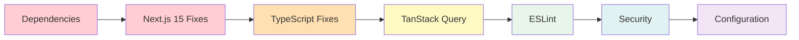

# Error Fix Workflow Diagram

```mermaid
graph TD
    A[Start Error Fix Process] --> B{Critical Build Issues?}
    
    B -->|Yes| C[Fix Missing Dependencies]
    C --> D[Add OpenAI Package]
    D --> E[Fix Better-Auth Adapter]
    E --> F[Update package.json]
    F --> G[Run npm install]
    
    B -->|No| H[Next.js 15 Compatibility]
    
    G --> H
    H --> I[Fix API Route Parameters]
    I --> J[Update notes/[id]/route.ts]
    J --> K[Update transcribe route]
    K --> L[Fix Auth Handler Export]
    L --> M[Update auth/[...all]/route.ts]
    
    M --> N{TypeScript Errors?}
    N -->|Yes| O[Fix User ID Type Mismatches]
    O --> P[Update API Routes]
    P --> Q[Implement AuthProvider]
    Q --> R[Fix AuthProvider.tsx]
    
    N -->|No| S[TanStack Query v5 Update]
    
    R --> S
    S --> T[Replace keepPreviousData]
    T --> U[Update useNotes.ts]
    
    U --> V{ESLint Issues?}
    V -->|Yes| W[Fix ESLint Config]
    W --> X[Update eslint.config.mjs]
    X --> Y[Remove Unused Imports]
    Y --> Z[Replace require() statements]
    
    V -->|No| AA[Security Fixes]
    
    Z --> AA
    AA --> AB[Add File Upload Validation]
    AB --> AC[Fix Environment Variables]
    AC --> AD[Create Tailwind Config]
    
    AD --> AE[Run Build Test]
    AE --> AF{Build Successful?}
    AF -->|No| AG[Debug Build Errors]
    AG --> B
    
    AF -->|Yes| AH[Run Lint Test]
    AH --> AI{Lint Pass?}
    AI -->|No| AJ[Fix Lint Issues]
    AJ --> V
    
    AI -->|Yes| AK[Run Integration Tests]
    AK --> AL{Tests Pass?}
    AL -->|No| AM[Debug Test Failures]
    AM --> B
    
    AL -->|Yes| AN[All Fixes Complete]
    
    style A fill:#e1f5fe
    style AN fill:#e8f5e9
    style B fill:#fff3e0
    style F fill:#fff3e0
    style G fill:#fff3e0
    style M fill:#fff3e0
    style U fill:#fff3e0
    style AD fill:#fff3e0
    style AF fill:#fff3e0
    style AH fill:#fff3e0
    style AK fill:#fff3e0
    style AN fill:#e8f5e9
```

## Error Categories and Impact Levels

### Critical Impact (Blocks Application)
1. **Missing Dependencies**
   - OpenAI package not installed
   - Incorrect better-auth adapter import
   - Impact: Build failure, runtime errors

2. **Next.js 15 Compatibility**
   - API route parameter handling
   - Auth handler export pattern
   - Impact: Route failures, authentication issues

### High Impact (Blocks Core Features)
3. **TypeScript Compilation**
   - User ID type mismatches
   - Empty AuthProvider implementation
   - Impact: Type errors, broken authentication

4. **TanStack Query v5**
   - Deprecated options usage
   - Impact: Query functionality issues

### Medium Impact (Code Quality)
5. **ESLint Configuration**
   - Incorrect import paths
   - Unused imports
   - Impact: Linting failures, code quality

6. **Import Style Inconsistencies**
   - Mixed require() and ES6 imports
   - Impact: Code maintainability

### Low Impact (Security & Best Practices)
7. **Security Vulnerabilities**
   - File upload validation
   - Environment variable exposure
   - Impact: Potential security risks

8. **Configuration Issues**
   - Missing Tailwind config
   - Impact: Styling issues

## Fix Dependencies



## Testing Workflow

```mermaid
graph TD
    A[Implement Fix] --> B[Run npm run build]
    B --> C{Build Success?}
    C -->|No| D[Debug Build Error]
    D --> A
    
    C -->|Yes| E[Run npm run lint]
    E --> F{Lint Pass?}
    F -->|No| G[Fix Lint Issues]
    G --> A
    
    F -->|Yes| H[Manual Testing]
    H --> I[Authentication Flow]
    I --> J[Note Management]
    J --> K[Voice Recording]
    K --> L[API Endpoints]
    
    L --> M{All Tests Pass?}
    M -->|No| N[Debug Test Failure]
    N --> A
    
    M -->|Yes| O[Fix Complete]
    
    style A fill:#e3f2fd
    style O fill:#e8f5e9
    style C fill:#fff3e0
    style F fill:#fff3e0
    style M fill:#fff3e0